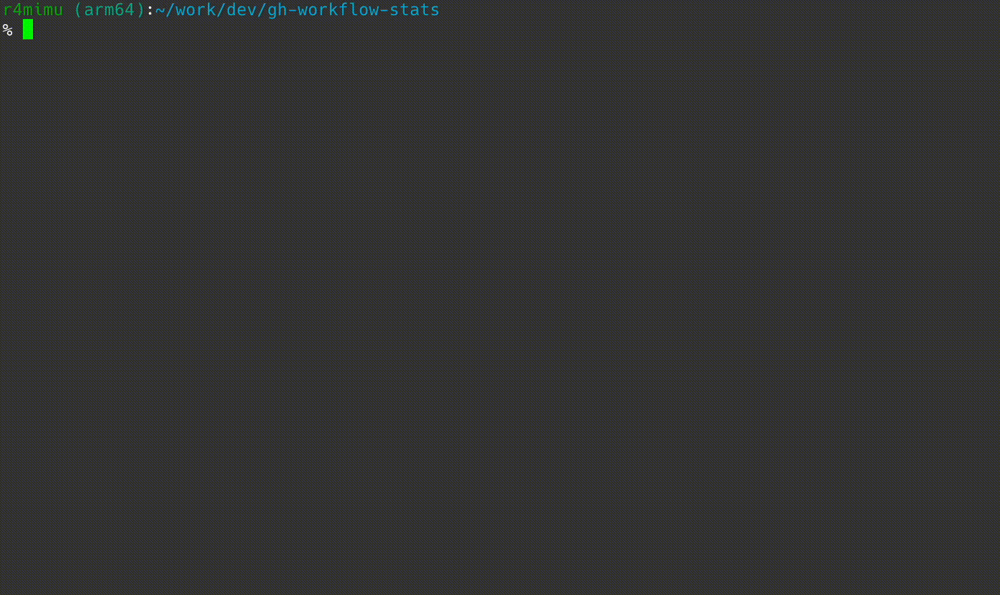

# GitHub Actions workflow stats

✨ A GitHub CLI extension to calculate the success rate and execution time of workflows and jobs.


- Calculate the success rate and execution time of workflow runs
  - Average, median, minimum, and maximum execution time of successful runs
  - Detailed each runs
    - Run ID, Actor, Started At, Duration(seconds), HTML URL
  - rate of success, failure, and others outcomes
- Calculate the success rate and execution time of workflow job steps
  - Average, median, minimum, and maximum execution time of successful jobs
  - Detailed each jobs
    - rate of success, failure, and others outcomes for each step
    - Detailed each steps
      - Step name, Step number, Runs count, Conclusion, Rate, Execution duration, Failure HTML URL
  - Most failed steps
  - Most time-consuming steps
- This tool can use composite action and reusable workflow.


## Installation

You can install it using the gh cli extension.

```
gh extensions install fchimpan/gh-workflow-stats
```

## Quick Start

If you want to get the success rate and execution time of a workflow:

```sh
$ gh workflow-stats -o $OWNER -r $REPO -f ci.yaml
```

If you want to get the success rate and execution time of a workflow job in JSON format:

```sh
$ gh workflow-stats jobs -o $OWNER -r $REPO -f ci.yaml --json
```

## Usage

```sh
$ gh workflow-stats -h
Get workflow runs stats. Retrieve the success rate and execution time of workflows.

Usage:
  workflow-stats [flags]
  workflow-stats [command]

Examples:
$ gh workflow-stats --org $OWNER --repo $REPO -f ci.yaml

Available Commands:
  completion  Generate the autocompletion script for the specified shell
  help        Help about any command
  jobs        Fetch workflow jobs stats. Retrieve the steps and jobs success rate.

Flags:
  -a, --actor string            Workflow run actor
  -A, --all                     Target all workflows in the repository. If specified, default fetches of 100 workflow runs is overridden to all workflow runs.
  -b, --branch string           Workflow run branch. Returns workflow runs associated with a branch. Use the name of the branch of the push.
  -C, --check-suite-id int      Workflow run check suite ID
  -c, --created string          Workflow run createdAt. Returns workflow runs created within the given date-time range.
                                 For more information on the syntax, see https://docs.github.com/en/search-github/getting-started-with-searching-on-github/understanding-the-search-syntax#query-for-dates
  -e, --event string            Workflow run event. e.g. push, pull_request, pull_request_target, etc.
                                 See https://docs.github.com/en/actions/using-workflows/events-that-trigger-workflows
  -x, --exclude-pull-requests   Workflow run exclude pull requests
  -f, --file string             The name of the workflow file. e.g. ci.yaml. You can also pass the workflow id as a integer.
  -S, --head-sha string         Workflow run head SHA
  -h, --help                    help for workflow-stats
  -H, --host string             GitHub host. If you want to use GitHub Enterprise Server, specify your GitHub Enterprise Server host. (default "github.com")
  -i, --id int                  The ID of the workflow. You can also pass the workflow file name as a string. (default -1)
      --json                    Output as JSON
  -o, --org string              GitHub organization
  -r, --repo string             GitHub repository
  -s, --status string           Workflow run status. e.g. completed, in_progress, queued, etc.
                                 See https://docs.github.com/en/rest/reference/actions#list-workflow-runs-for-a-repository

Use "workflow-stats [command] --help" for more information about a command.
```

### Fetch number of workflow

By default, `workflow-stats` and `workflow-stats jobs` commands will return **100** workflow runs. If you want to get all workflow runs, you can use the `--all` flag.
However, GitHub API has a rate limit, so please combine other parameters as appropriate to reduce the number of API requests.

```sh
# Get executed at 2022-01-01 or later and actor is $ACTOR
$ gh workflow-stats -o $OWNER -r $REPO -f ci.yaml -A -c ">2024-01-01" -a $ACTOR
```

More details on API rate limits can be found in the [GitHub API documentation](https://docs.github.com/en/rest/using-the-rest-api/rate-limits-for-the-rest-api?apiVersion=2022-11-28).

### GitHub Enterprise Server

If you want to use GitHub Enterprise Server, you can use the `--host` flag or set the `GH_HOST` environment variable.
Host name is `http(s)://[your-github-host]/api/v3/`

```sh
$ export GH_HOST="your-github-host"
$ gh workflow-stats -o $OWNER -r $REPO -f ci.yaml
# or
$ gh workflow-stats -o $OWNER -r $REPO -f ci.yaml --host="your-github-host"
```

### How it works
This tool retrieves workflow execution statistics using the GitHub API. For more details on the parameters, please refer to the GitHub API reference.
- [Workflow runs](https://docs.github.com/en/rest/actions/workflow-runs?apiVersion=2022-11-28#list-workflow-runs-for-a-workflow)
- [Workflow jobs](https://docs.github.com/en/rest/actions/workflow-jobs?apiVersion=2022-11-28#get-a-job-for-a-workflow-run)

## Standard Output

[Sample output](./images/sample-output.txt)

### 🏃 Total runs

`Total runs` is the total number of workflow runs that `status` is `completed`. It includes `success`, `failure`, and `others` outcomes. `Others` outcomes include `cancelled`, `skipped`, etc.

### ⏰ Workflow run execution time stats

`Workflow run execution time stats` is the average execution time of workflows with **`success` conclusion and `completed` status**.

### 📈 Top 3 jobs with the highest failure counts (failure runs / total runs)

`Top 3 jobs with the highest failure counts` is the top 3 jobs with the highest failure counts. It is **not** failure rate.
Instead of using the success rate, the tool displays jobs based on the number of failures, as jobs with fewer executions but a high failure rate would otherwise be ranked higher.

 The number of jobs displayed can be changed with a command-line argument `-n`.


### 📊 Top 3 jobs with the longest execution average duration

`Top 3 jobs with the longest execution average duration` is the top 3 jobs with the longest execution average duration.

The number of jobs displayed can be changed with a command-line argument `-n`.

## JSON Schema Overview

If you use `--json` flag, the output will be a JSON object with the following structure. You can see sample output in [sample-output.json](./images/sample-output.json).

### Workflow runs

| Field Name                    | Type             | Description                                                     |
| ----------------------------- | ---------------- | --------------------------------------------------------------- |
| `workflow_runs_stats_summary` | Object           | An object containing a summary of statistics for workflow runs. |
| `workflow_jobs_stats_summary` | Array of objects | An array containing the summary statistics for workflow jobs.   |

#### `workflow_runs_stats_summary` Object

| Field Name                 | Type    | Description                                                         |
| -------------------------- | ------- | ------------------------------------------------------------------- |
| `total_runs_count`         | Integer | The total number of workflow runs.                                  |
| `name`                     | String  | The name of the workflow.                                           |
| `rate`                     | Object  | An object containing rates of success, failure, and other outcomes. |
| `execution_duration_stats` | Object  | An object containing statistics on execution durations.             |
| `conclusions`              | Object  | An object containing detailed information for each conclusion type. |

##### `rate` Object

| Field Name     | Type  | Description                                                     |
| -------------- | ----- | --------------------------------------------------------------- |
| `success_rate` | Float | The rate of success executions.                                 |
| `failure_rate` | Float | The rate of failed executions.                                  |
| `others_rate`  | Float | The rate of others outcomes. e.g., `cancelled`, `skipped`, etc. |

##### `execution_duration_stats` Object

`execution_duration_stats` is the average execution time of workflows with `success` conclusion and `completed` status.

| Field Name | Type  | Description                            |
| ---------- | ----- | -------------------------------------- |
| `min`      | Float | Minimum execution time in seconds.     |
| `max`      | Float | Maximum execution time in seconds.     |
| `avg`      | Float | Average execution time in seconds.     |
| `med`      | Float | Median execution time in seconds.      |
| `std`      | Float | Standard deviation of execution times. |

##### `conclusions` Object

| Key       | Description                                                                                                             |
| --------- | ----------------------------------------------------------------------------------------------------------------------- |
| `failure` | Statistics for executions concluded as `failure`.                                                                       |
| `others`  | Statistics for executions that do not fit into the typical success/failure categories. e.g `cancelled`, `skipped`, etc. |
| `success` | Statistics for executions concluded as `success`.                                                                       |

##### Conclusion Objects (`failure`, `others`, `success`)

| Field Name      | Type    | Description                              |
| --------------- | ------- | ---------------------------------------- |
| `runs_count`    | Integer | The number of runs with this conclusion. |
| `workflow_runs` | Array   | An array of objects detailing each run.  |

##### `workflow_runs` Objects

| Field Name       | Type     | Description                                                                                                                                                           |
| ---------------- | -------- | --------------------------------------------------------------------------------------------------------------------------------------------------------------------- |
| `id`             | Integer  | The ID of the run.                                                                                                                                                    |
| `status`         | String   | The status of the run (e.g., `completed`, `queued`).                                                                                                                  |
| `conclusion`     | String   | The conclusion of the run (e.g., `success`, `failure`).                                                                                                               |
| `actor`          | String   | The actor who initiated the run.                                                                                                                                      |
| `run_attempt`    | Integer  | The attempt number of the run.                                                                                                                                        |
| `html_url`       | String   | The HTML URL to the run on GitHub.                                                                                                                                    |
| `run_started_at` | DateTime | The start time of the run.                                                                                                                                            |
| `duration`       | Integer  | The duration of the run in seconds. Duration defined as `RunUpdatedAt` - `RunStartedAt`. **Note**: GitHub API is not provide duration. Thus, this may be not correct. |


### Workflow Jobs Object

Each object in the `workflow_jobs_stats_summary` array contains the following fields:

| Field Name                 | Type             | Description                                                                                                                                                                              |
| -------------------------- | ---------------- | ---------------------------------------------------------------------------------------------------------------------------------------------------------------------------------------- |
| `name`                     | String           | The name of the workflow job.                                                                                                                                                            |
| `total_runs_count`         | Integer          | The total number of runs for this job.                                                                                                                                                   |
| `rate`                     | Object           | An object containing the rates of success, failure, and others.                                                                                                                          |
| `conclusions`              | Object           | An object containing the count of runs concluded as failure, success or others.                                                                                                          |
| `execution_duration_stats` | Object           | An object with statistics about the execution duration. Duration defined as `GetStartedAt` - `CompletedAt`. **Note**: GitHub API is not provide duration. Thus, this may be not correct. |
| `steps_summary`            | Array of objects | An array with summary statistics for each step of the job.                                                                                                                               |

### Steps Summary Object

Each object in the `steps_summary` array includes:

| Field Name                 | Type    | Description                                                                                                                                                                                           |
| -------------------------- | ------- | ----------------------------------------------------------------------------------------------------------------------------------------------------------------------------------------------------- |
| `name`                     | String  | The name of the step.                                                                                                                                                                                 |
| `number`                   | Integer | The step number in the job's sequence.                                                                                                                                                                |
| `runs_count`               | Integer | The number of times this step was run.                                                                                                                                                                |
| `conclusion`               | Object  | An object containing the count of success, failure and others.                                                                                                                                        |
| `rate`                     | Object  | An object containing the success rate, failure rate, and others rate for the step.                                                                                                                    |
| `execution_duration_stats` | Object  | An object with statistics about the execution duration for the step. Duration defined as `GetStartedAt` - `CompletedAt`. **Note**: GitHub API is not provide duration. Thus, this may be not correct. |
| `failure_html_url`         | Array   | An array of URLs to logs of the failed runs, if any.                                                                                                                                                  |

#### Conclusion Object for Step

| Key       | Description                                                                                                             |
| --------- | ----------------------------------------------------------------------------------------------------------------------- |
| `failure` | Statistics for executions concluded as `failure`.                                                                       |
| `others`  | Statistics for executions that do not fit into the typical success/failure categories. e.g `cancelled`, `skipped`, etc. |
| `success` | Statistics for executions concluded as `success`.                                                                       |


### Sample JSON Output

```json
{
"workflow_runs_stats_summary": {
  "total_runs_count": 100,
  "name": "Tests",
  "rate": {
    "success_rate": 0.79,
    "failure_rate": 0.14,
    "others_rate": 0.06999999999999995
  },
  "execution_duration_stats": {
    "min": 365,
    "max": 1080,
    "avg": 505.54430379746833,
    "med": 464,
    "std": 120.8452088122228
  },
  "conclusions": {
    "failure": {
      "runs_count": 14,
      "workflow_runs": [
        {
          "id": 8178615249,
          "status": "completed",
          "conclusion": "failure",
          "actor": "XXX",
          "run_attempt": 1,
          "html_url": "https://github.com/xxx/xxx/actions/runs/8178615249",
          "run_started_at": "2024-03-06T20:53:43Z",
          "duration": 0
        },
        ...
      ]
    },
}
},
"workflow_jobs_stats_summary": [
  {
    "name": "build (ubuntu-latest)",
    "total_runs_count": 93,
    "rate": {
      "success_rate": 0.8494623655913979,
      "failure_rate": 0.15053763440860216,
      "others_rate": 0
    },
    "conclusions": {
      "failure": 14,
      "success": 79
    },
    "execution_duration_stats": {
      "min": 166,
      "max": 225,
      "avg": 185.2405063291139,
      "med": 178,
      "std": 15.9367541045597
    },
    "steps_summary": [
      {
        "name": "Set up job",
        "number": 1,
        "runs_count": 93,
        "conclusion": {
          "success": 93
        },
        "rate": {
          "success_rate": 1,
          "failure_rate": 0,
          "others_rate": 0
        },
        "execution_duration_stats": {
          "min": 0,
          "max": 3,
          "avg": 1.3225806451612903,
          "med": 1,
          "std": 0.6584649846191345
        },
        "failure_html_url": []
      },
      ...
    ]
  },
  ...
]
}
```
